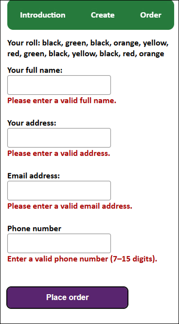
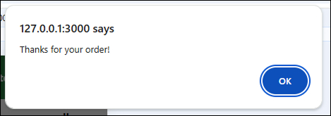

# Assignment 2

## Website URL
https://shielsr.github.io/assignment-02/

## Github Repo
https://github.com/shielsr/assignment-02

## Full Documentation
[View full documentation](documentation.md)

## Project goal
The goal of the project is to allow users to create their own bespoke packet of pastille sweets. They can place an order to have the packet created and delivered.

## Features
The user can:
- Choose what flavours are included in their packet
- Choose the quantity of each flavour
- Randomise the order of sweets in the packet
- Get error feedback when choosing too few/many sweets
- Order their desired packet to their home.

# Instructions on how to use the site

## Navbar
This is a one-page website. Use the three buttons in the navbar to autoscroll up and down to anchor links within the page.

##  'Create' form
Use the 'Create' form to define how many of each pastille flavour you want. A live tracker at the top shows how many sweets you need to add/remove to hit the target of 12.
Press the CTA button when your roll is ready.

  

## Canvas with roll
On a successful form submission, a mockup of the user's pastille roll is generated in the canvas. On mobile, the user is autoscrolled down to the canvas. The individual pastilles are pngs of actual pastilles that I photographed and cropped.

## Order form
If the user is happy with their creation, they can go to the order form and get their pastille roll delivered to an address of their choice. Includes validation. On a successful submission, an alert pops up (I haven't created any database for storing the data).

    

## Order form prior to roll generation
It's worth noting that a warning box appears in the Order section prior to generating a pastille roll. This is added & removed via Javascript. See [Full Documentation](documentation.md) for details.

