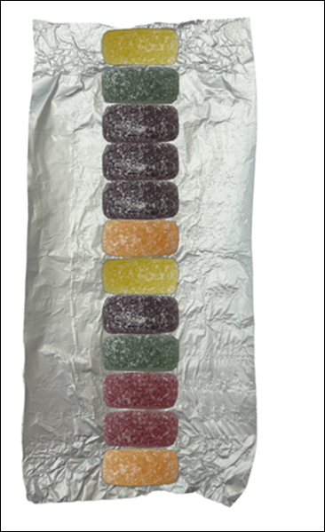
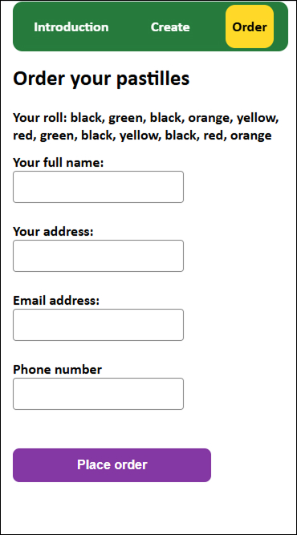

# Assignment 2

## Website URL
https://shielsr.github.io/assignment-02/

## Github Repo
https://github.com/shielsr/assignment-02

## Additional Documentation

## Project goal
The goal of the project is to allow users to create their own bespoke packet of pastille sweets. They can place an order to have the packet created and delivered.

## Features

- Choose what flavours are included in their packet
- Choose the quantity of each flavour
- Randomise the order of sweets in the packet
- Get error feedback when choosing too few/many sweets
- Order your desired packet to your home

## How I went about it

- I started with a simple form with 2 dropdowns and a submit button. I followed the Week 7 Unit 12 lecture recording to create the JS, adding event listeners etc.
- Once that worked, I wanted to put a max of 10 on the total with a warning message.
- Then I wanted to create a new array containing the amounts of flavours, e.g. if the user selected 3 reds and 2 blues then the array would be red, red, red, blue, blue. I read up on how to map one array into another. I went with a forEach and a for loop.
- I wanted to randomise the order of the flavours in the array, so it was more like a real roll of sweets. I researched it and found the Fisher-Yates function.
- The HTML for the dropdowns was becoming unwieldy, so I looked up other options. I went with the numerical stepper instead of dropdowns.
- I wanted to make a visual/graphical representation of the roll of pastilles. I considered using SVGs but thought it was a good opportunity to use what was covered in the Canvas lessson (Week 9). I worked on 'drawing' the pastilles onto the canvas based on the array.
- Found a bug where if you reduced the amount of selected sweets, the old rectangles remained on the canvas anyway. Added in `clearRect` to clear the canvas each time. 
- I decided to give my pastilles rounded corners. Did some research and switched from `.fillRect` to `.roundRect`
- Added new min/max pastille total of 10. Wrote new error messaging with "add x more" or "remove y" to help the user (this made the above bug irrelevant but it's fixed anyway)
- Made big style changes: Styled the form. Styled the buttons including with focus states. Add background 'tinfoil' image to the canvas. Add an order form, which is only revealed after the user has generated their first roll of pastilles. Need to fix a bug on mobile where the order form isn't revealed.
- Fixed the bug with `height:auto`. iOS was also 'zooming in' on input fields, which I solved by making the input text 16px. Also added validation for email and number fields on the order form.
- Added a 'live count' of the sweets as they're added along with error styling.
- Replaced the vector rectangles on the canvas with PNG photos of actual pastilles. I removed the image backgrounds in Figma. I had to rewrite the entire `drawPastille()` function to work with images instead of vectors.
- I started using if-else statements to call the different pngs, but it was too messy. Instead, I concatenated the image src using the colour parameter, which tidied up the function nicely.
- Tidied up the javascript by replacing global variables (which I delcared at the top of the .js file) to functions, e.g. function `redValue()` instead of `let redValue`. This allowed me to remove the `getTotalAmounts()` function and have the input event listener directly trigger the `liveCounting()` function.
- Added proper validation to the order form for name, address, email and phone. In the interests of speed I grabbed standard validation code and used it here.
- Fleshed out the structure of the HTML, adding in new sections and autoscroll nav links. Also did an overhaul of the CSS to improve the design and UX/UI, including focus and hover states on the buttons and alt tags on the logo.
- I wanted to demonstrate that I could add and remove elements using `.createElement`, `.appendChild` and `.removeChild`, so I refactored the warning that appears in the Order section (before the user has generated a roll). It's no the most efficient use of .createElement (I realise it's easier to just hard code it) but I wanted to use add it with javascript purely for demo purposes.

## Instructions

### Navbar
This is a one-page website. Use the three buttons in the navbar to autoscroll up and down to anchor links within the page.

###  'Create' form
Use the 'Create' form to define how many of each pastille flavour your want. A live tracker at the top shows how many sweets you need to add/remove to hit the target of 12.
Press the CTA button when your roll is ready.

  

### Canvas with roll
On a successful form submission, a mockup of the user's pastille roll is generated in the canvas. On mobile, the user is autoscrolled down to the canvas.

### Order form
If the user is happy with their creation, they can go to the order form and get their pastille roll delivered to an address of their choice. Includes validation. On a successful submission, an alert pops up (I haven't created any database for storing the data).

    

### Order form prior to roll generation
It's worth noting that a warning box appears in the Order section prior to generating a pastille roll. This is added & removed via Javascript.