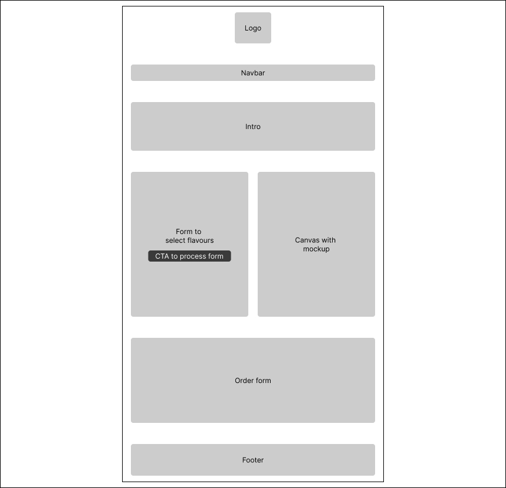
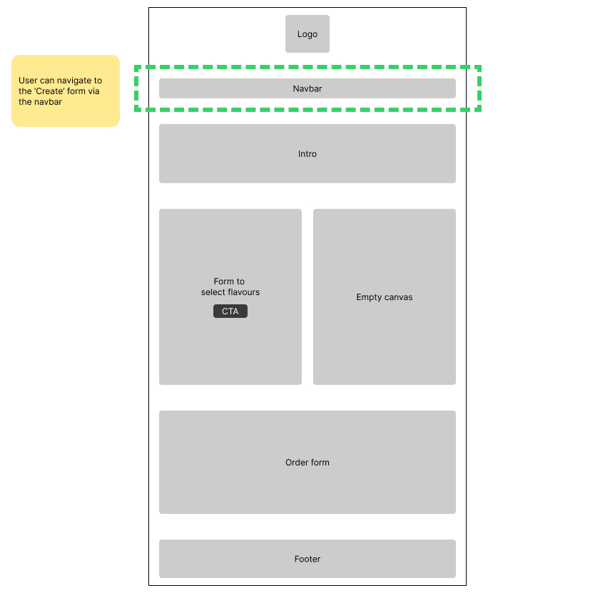
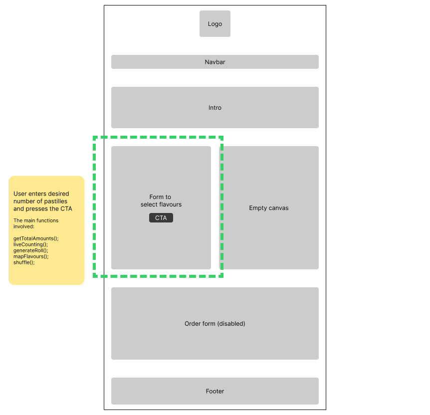
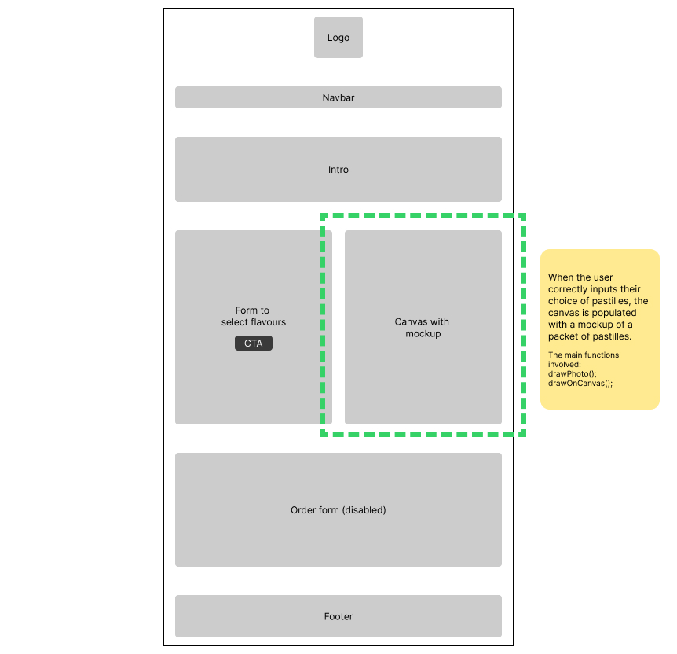
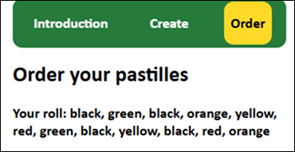

# My design decisions
## User stories

### Roles:
- Existing fan of pastilles
- Brand new customer
- Health-conscious customer
- Gift giver

### User stories:

#### 1. Favourite flavours
[MUST] As an existing fan, I want to create a bespoke packet of pastilles with my favourite flavours, so I can make the best possible packet for me.

#### 2. Live count
[MUST] As a user, I want a live count of how many pastilles I've added to my packet, so I don't have to backtrack and correct errors later.

#### 3. Visual representation
[MUST] As a user, I want to be able to see a mockup of the packet, so I know how it will look before I order it. 

#### 4. Shipping
[MUST] As any user type, I want to be able to ship my creation to a real-world address, so I or a loved one can eat what I have designed.

### Future work:
I did not cater for the following user stories in this version of the website, as they are beyond the scope of the assignment.

#### 1. Gifting
[SHOULD] As a gift giver, I want to be able to ship my creation to others as a gift, so that I can share my creation with loved ones.

#### 2. Trying all flavours
[SHOULD] As a brand new customer, I want to auto-generate a tube with a random combination of all flavours, so I can try all the flavours.

#### 3. Health options
[SHOULD] As a health-conscious customer, I want to have health-related options, so I can order a healthier version of the product.

## Content
The page will include:
- A simple introduction section.
- A form asking for the desired quantity of pastille flavours, which are: 
    - Red
    - Yellow
    - Green
    - Orange
    - Black
- A 'Generate' button to put the options together into an array.
- A visual representation of the roll of pastilles.

## Prioritised tasks:
1. Create a html page with a form allowing the user to set the amount of each flavour of pastille they'd like per pack using dropdowns.
2. The packet must contain a max number of sweets (12)
3. Create a 'step 2' order shipping form.

## Wireframes

I created basic wireframes in Figma for mobile and desktop, with the mobile layout responsively catering for tablets too.

  

## User journey happy path
The happy path involves the user reaching the 'Create' form, selecting their desired flavours, generating the mockup of the pastilles and then placing an order.

### Step 01: User navigates to the 'Create' form

### Step 02: User enters their desired flavours

### Step 03: Mockup generated

### Step 04: 'Order' form

# My development process
## How I went about it

The following is a step-by-step account of how I did the project, which closely corresponds with the series of commits I made to the repo.

- I started with a simple form with 2 dropdowns and a submit button. I followed the Week 7 Unit 12 lecture recording to create the JS, adding event listeners etc.
- Once that worked, I wanted to put a max of 10 on the total with a warning message.
- Then I wanted to create a new array containing the amounts of flavours, e.g. if the user selected 3 reds and 2 blues then the array would be red, red, red, blue, blue. I read up on how to map one array into another. I went with a forEach and a for loop.
- I wanted to randomise the order of the flavours in the array, so it was more like a real roll of sweets. I researched it and found the Fisher-Yates function.
- The HTML for the dropdowns was becoming unwieldy, so I looked up other options. I went with the numerical stepper instead of dropdowns.
- I wanted to make a visual/graphical representation of the roll of pastilles. I considered using SVGs but thought it was a good opportunity to use what was covered in the Canvas lessson (Week 9). I worked on 'drawing' the pastilles onto the canvas based on the array.
- Found a bug where if you reduced the amount of selected sweets, the old rectangles remained on the canvas anyway. Added in `clearRect` to clear the canvas each time. 
- I decided to give my pastilles rounded corners. Did some research and switched from `.fillRect` to `.roundRect`
- Added new min/max pastille total of 10. Wrote new error messaging with "add x more" or "remove y" to help the user (this made the above bug irrelevant but it's fixed anyway)
- Made big style changes: Styled the form. Styled the buttons including with focus states. Add background 'tinfoil' image to the canvas. Add an order form, which is only revealed after the user has generated their first roll of pastilles. Need to fix a bug on mobile where the order form isn't revealed.
- Fixed the bug with `height:auto`. iOS was also 'zooming in' on input fields, which I solved by making the input text 16px. Also added validation for email and number fields on the order form.
- Added a 'live count' of the sweets as they're added along with error styling.
- Replaced the vector rectangles on the canvas with PNG photos of actual pastilles. I removed the image backgrounds in Figma. I had to rewrite the entire `drawPastille()` function to work with images instead of vectors.
- I started using if-else statements to call the different pngs, but it was too messy. Instead, I concatenated the image src using the colour parameter, which tidied up the function nicely.
- Tidied up the javascript by replacing global variables (which I delcared at the top of the .js file) to functions, e.g. function `redValue()` instead of `let redValue`. This allowed me to remove the `getTotalAmounts()` function and have the input event listener directly trigger the `liveCounting()` function.
- My order form relied on browser validation, but it was recommended that I add full javascript validation for name, address, email and phone. In the interests of speed I researched & used standard form validation code, tweaking it to suit my project.
- Fleshed out the structure of the HTML, adding in new sections and autoscroll nav links. Also did an overhaul of the CSS to improve the design and UX/UI, including focus and hover states on the buttons and alt tags on the logo.
- I wanted to demonstrate that I could add and remove elements using `.createElement`, `.appendChild` and `.removeChild`, so I refactored the warning that appears in the Order section (before the user has generated a roll). It's not the most effective use of .createElement (I realise it's easier to just hard code it) but I wanted to use add it with javascript purely for demo purposes.

# Challenges faced

Some challenges I faced include:

## Adding images to the canvas
I initially drew simple rectangles to the canvas to represent the pastilles, but I wanted to challenge myself and use real photos of pastilles instead. So, I took photos & cropped them in Figma. The biggest challange was figuring out how to add pngs to the canvas. I initially had a huge function full of if/else statements, but then I realised I could just pass a 'colour' parameter into the filenames & call the image that way.

## Spelling out the flavours
Probably the biggest challenge was figuring out the `mapFlavours()` function. My goal was to have the 12 chosen pastilles listed in an array as a series of strings, e.g. `[red, red, green, green, green, ...etc.]`. I went back to the lectures on forEach loops and pushing into arrays, and eventually did a `for` loop inside a `forEach` loop.

## Bugfixes
In the Development process section above I documented some of the bugs I encountered along the way. Nothing too challenging, but each one required effort to figure out.

# Examples of DOM manipulation
## Live counter on 'Create' form
The form for choosing the flavours has a live counter at the top. I used  `.innerText` to change the total count, depending on what numbers the user enters in the form.

## Swapping classes on live counter
In the live counter, if the total goes over or under 12, I use `.classList.add` and `.classList.remove` to change the CSS class on the counter, turning it red or green.

## Adding the 'Warning' box
When the page loads, I use `.createElement` and `.appendChild` to add a warning box in the 'Order' section. It would have been easier to hard code the box in the HTML, but I wanted to demonstrate that I could do it. 

## Removing the 'Warning' box
When the user generates their pastilles, I use `.removeChild` to get rid of the warning box in the 'Order' section.  

## Printing the list of pastilles on the order form
I take the array of pastilles generated by the 'Create' form and print them into the 'Order' section using `.innerText`.

